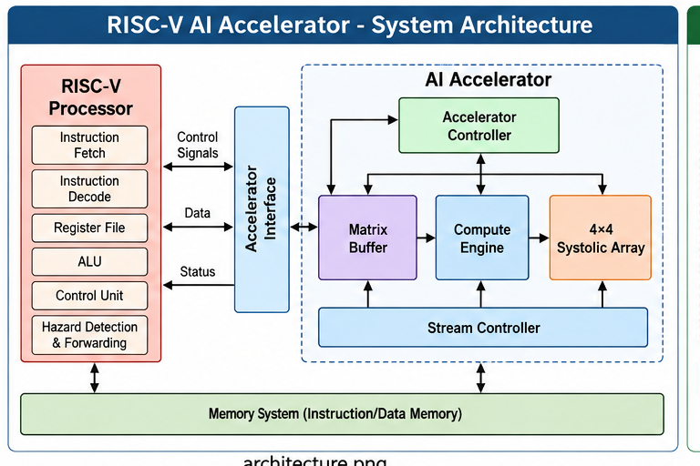
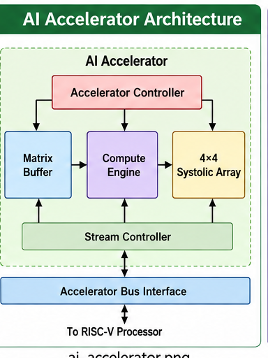
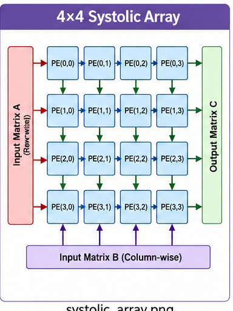
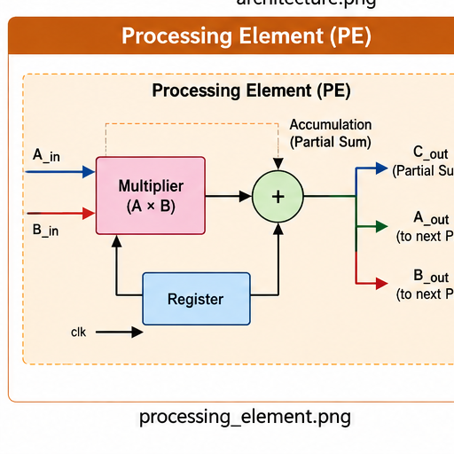
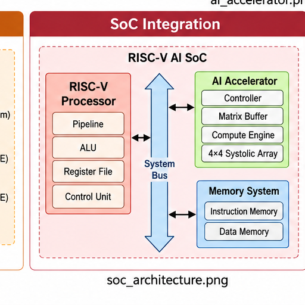
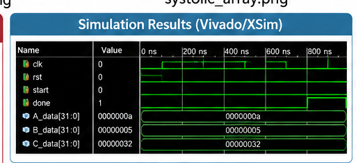
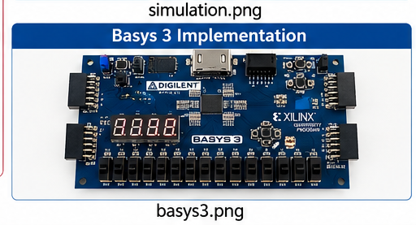

# RISC-V AI Accelerator

A hardware implementation of a RISC-V based AI accelerator integrating a RISC-V processor with dedicated hardware for matrix-oriented and AI-related computations.



---

## Overview

This project combines a RISC-V processor subsystem with a dedicated AI accelerator datapath.

The design includes:

- RISC-V processor datapath
- Instruction decoder
- Register file
- Arithmetic Logic Unit (ALU)
- Branch unit
- Immediate generator
- Hazard detection
- Data forwarding
- AI accelerator interface
- AI accelerator controller
- AI compute engine
- Matrix buffer
- Dot-product computation
- Processing Elements (PEs)
- Stream controller
- 4×4 systolic-array based computation
- SoC-level integration
- Basys 3 support

The RTL design is implemented in Verilog and developed using AMD/Xilinx Vivado.

---

## System Architecture

The system consists of a RISC-V processor connected to a dedicated AI accelerator.


The RISC-V processor handles instruction execution and system control, while the AI accelerator provides dedicated hardware for computationally intensive matrix operations.

### Major Data Path

**RISC-V Processor → Accelerator Interface → AI Accelerator → Compute Engine → Systolic Array → Result**

---

## RISC-V Processor

The RISC-V processor subsystem contains the major components required for instruction execution.

### Processor Modules

| Module | Function |
|---|---|
| `riscv_pipeline.v` | Main RISC-V processor pipeline |
| `riscv_alu.v` | Arithmetic and logical operations |
| `riscv_decoder.v` | Instruction decoding |
| `riscv_regfile.v` | Register storage |
| `riscv_imm_gen.v` | Immediate value generation |
| `riscv_branch_unit.v` | Branch and comparison operations |
| `riscv_hazard.v` | Hazard detection |
| `riscv_forwarding.v` | Data forwarding |

The processor provides the control and instruction-execution functionality required to interact with the AI accelerator.

---

## AI Accelerator

The AI accelerator provides dedicated hardware for computationally intensive operations.



### Accelerator Modules

| Module | Function |
|---|---|
| `ai_accelerator.v` | Main AI accelerator |
| `ai_accelerator_top.v` | Top-level accelerator integration |
| `ai_accel_controller.v` | Accelerator control logic |
| `ai_accel_bus.v` | Accelerator bus interface |
| `ai_accelerator_bus.v` | Accelerator bus integration |
| `ai_compute_engine.v` | Computational datapath |
| `ai_matrix_buffer.v` | Matrix data storage |
| `ai_dot4.v` | Dot-product computation |
| `ai_pe.v` | Processing element |
| `ai_stream_controller.v` | Data streaming and control |
| `ai_systolic_4x4.v` | 4×4 systolic-array computation |

---

## 4×4 Systolic Array

The accelerator contains a 4×4 systolic-array structure consisting of multiple Processing Elements.



The systolic architecture enables parallel computation and regular data movement between processing elements.

Each Processing Element performs multiply-accumulate operations while data propagates through the array.

The architecture allows multiple multiplication and accumulation operations to occur in parallel.

### Systolic Array Operation

For matrix multiplication:

```text
C = A × B
```

The input data is supplied to the Processing Elements in a structured manner. Each PE performs arithmetic operations and passes intermediate data to neighboring PEs.

This allows matrix computations to be distributed across the array rather than being executed sequentially by a single computational unit.

---

## Processing Element

The Processing Element (PE) is one of the fundamental computational units of the systolic array.



A PE receives input operands, performs arithmetic computation, accumulates the result, and propagates data to neighboring processing elements.

### Simplified PE Operation

```text
A × B → Multiply → Accumulate → Partial Sum
```

A simplified dot-product operation can be represented as:

```text
Result = A0×B0 + A1×B1 + A2×B2 + A3×B3
```

The PE is therefore the basic computational building block used to construct the systolic array.

---

## Matrix Buffer

The matrix buffer stores input matrix data before it is supplied to the compute engine.

The matrix buffer helps organize the input data required by the systolic-array computation.

### Main Responsibilities

- Storing matrix values
- Providing matrix data to the compute engine
- Supporting organized data movement
- Maintaining data availability during computation
- Supplying operands to the processing datapath

The corresponding RTL module is:

```text
ai_matrix_buffer.v
```

---

## Dot Product Unit

The dot-product unit performs multiplication and accumulation operations required for matrix computation.

The basic operation can be represented as:

```text
Y = Σ(Ai × Bi)
```

For four input elements:

```text
Y = A0×B0 + A1×B1 + A2×B2 + A3×B3
```

The RTL implementation is provided by:

```text
ai_dot4.v
```

The dot-product operation forms the fundamental arithmetic operation used in matrix multiplication and many machine-learning workloads.

---

## Accelerator Controller

The accelerator controller manages the operation of the AI accelerator.

It coordinates:

- Input data transfer
- Matrix loading
- Computation start
- Processing-element operation
- Data movement
- Result generation
- Accelerator completion

The controller is implemented using:

```text
ai_accel_controller.v
```

The controller acts as the control path between the processor/interface and the accelerator datapath.

---

## Stream Controller

The stream controller manages the movement of data through the accelerator.

Its responsibilities include:

- Controlling input data flow
- Supplying data to the compute engine
- Coordinating data movement through the systolic array
- Managing valid/control signals
- Supporting continuous data processing

The corresponding module is:

```text
ai_stream_controller.v
```

---

## Compute Engine

The compute engine forms the main computational datapath of the AI accelerator.

It connects the matrix buffer, dot-product logic and Processing Elements to perform the required computation.

The corresponding RTL module is:

```text
ai_compute_engine.v
```

The compute engine provides the arithmetic functionality required for matrix-oriented workloads.

---

## Accelerator Bus Interface

The accelerator bus interface provides communication between the processor subsystem and the AI accelerator.

Relevant modules include:

```text
ai_accel_bus.v
ai_accelerator_bus.v
```

The interface allows the processor to communicate with the accelerator by transferring control information, input data and computation results.

---

## SoC Integration

The RISC-V processor and AI accelerator are integrated into a System-on-Chip structure.



The SoC provides an interface between the processor subsystem and the accelerator.

### Major Components

- RISC-V processor
- AI accelerator
- Accelerator bus/interface
- Control logic
- Memory/data interfaces
- Processing datapath

The main integration module is:

```text
riscv_ai_soc.v
```

A Basys 3 specific SoC integration is also provided through:

```text
riscv_ai_soc_basys3.v
```

---

## Verification

The project contains multiple Verilog testbenches for verifying individual modules as well as system-level functionality.

### Verification Coverage

Verification covers:

- RISC-V ALU
- Instruction decoder
- Register file
- Immediate generator
- Branch unit
- Hazard detection
- Forwarding logic
- RISC-V pipeline
- Processing Element
- Dot-product unit
- Matrix buffer
- Stream controller
- Compute engine
- Systolic array
- AI accelerator
- Accelerator controller
- Complete RISC-V AI SoC

### Example Testbench Files

```text
tb_ai_accel_bus.v
tb_ai_accelerator.v
tb_ai_accelerator_top.v
tb_ai_compute_engine.v
tb_ai_dot4.v
tb_ai_matrix_buffer.v
tb_ai_pe.v
tb_ai_stream_controller.v
tb_ai_systolic_4x4.v

tb_riscv_ai_soc.v
tb_riscv_alu.v
tb_riscv_branch_unit.v
tb_riscv_decoder.v
tb_riscv_forwarding.v
tb_riscv_hazard.v
tb_riscv_imm_gen.v
tb_riscv_pipeline.v
tb_riscv_regfile.v
```

---

## Simulation Results

Simulation is used to verify the functional behavior of the processor, accelerator and integrated SoC.



The simulation environment verifies correct:

- Instruction execution
- Data movement
- Arithmetic operations
- Matrix processing
- Accelerator control
- Systolic-array operation
- Processor–accelerator interaction
- Result generation

Simulation-based verification helps identify functional errors before FPGA implementation.

---

## Basys 3 Implementation

The design includes support for implementation on the Digilent Basys 3 FPGA development board.



The Basys 3 interface is supported through:

```text
basys3_ai_demo.v
riscv_ai_soc_basys3.v
```

The corresponding FPGA constraints are provided in:

```text
basys3_ai_demo.xdc
```

The Basys 3 implementation provides a hardware platform for demonstrating the RISC-V and AI accelerator integration.

---

## Project Structure

```text
riscv_ai_accelerator/
│
├── riscv_ai_accelerator.srcs/
│   │
│   ├── constrs_1/
│   │   └── new/
│   │       └── basys3_ai_demo.xdc
│   │
│   ├── sim_1/
│   │   └── new/
│   │       ├── tb_ai_accel_bus.v
│   │       ├── tb_ai_accelerator.v
│   │       ├── tb_ai_accelerator_top.v
│   │       ├── tb_ai_compute_engine.v
│   │       ├── tb_ai_dot4.v
│   │       ├── tb_ai_matrix_buffer.v
│   │       ├── tb_ai_pe.v
│   │       ├── tb_ai_stream_controller.v
│   │       ├── tb_ai_systolic_4x4.v
│   │       ├── tb_riscv_ai_soc.v
│   │       ├── tb_riscv_alu.v
│   │       ├── tb_riscv_branch_unit.v
│   │       ├── tb_riscv_decoder.v
│   │       ├── tb_riscv_forwarding.v
│   │       ├── tb_riscv_hazard.v
│   │       ├── tb_riscv_imm_gen.v
│   │       ├── tb_riscv_pipeline.v
│   │       └── tb_riscv_regfile.v
│   │
│   └── sources_1/
│       └── new/
│           ├── ai_accel_bus.v
│           ├── ai_accel_controller.v
│           ├── ai_accelerator.v
│           ├── ai_accelerator_bus.v
│           ├── ai_accelerator_top.v
│           ├── ai_compute_engine.v
│           ├── ai_dot4.v
│           ├── ai_matrix_buffer.v
│           ├── ai_pe.v
│           ├── ai_stream_controller.v
│           ├── ai_systolic_4x4.v
│           ├── basys3_ai_demo.v
│           ├── riscv_ai_soc.v
│           ├── riscv_ai_soc_basys3.v
│           ├── riscv_alu.v
│           ├── riscv_branch_unit.v
│           ├── riscv_decoder.v
│           ├── riscv_forwarding.v
│           ├── riscv_hazard.v
│           ├── riscv_imm_gen.v
│           ├── riscv_pipeline.v
│           └── riscv_regfile.v
│
├── images/
│   ├── architecture.png
│   ├── ai_accelerator.png
│   ├── systolic_array.png
│   ├── processing_element.png
│   ├── soc_architecture.png
│   ├── simulation.png
│   └── basys3.png
│
├── .gitignore
└── README.md
```

---

## Tools and Technologies

- Verilog HDL
- RISC-V ISA
- AMD/Xilinx Vivado
- Xilinx FPGA
- Basys 3
- RTL Simulation
- Git
- GitHub

---

## Key Concepts Demonstrated

- RISC-V processor architecture
- Processor pipelining
- Instruction decoding
- Register-file design
- ALU design
- Branch handling
- Data hazards
- Forwarding
- Hardware acceleration
- Matrix computation
- Dot-product computation
- Processing Elements
- Systolic arrays
- RTL design
- SoC integration
- Hardware verification
- FPGA implementation

---

## Applications

The architecture can be used as a foundation for hardware acceleration of:

- Matrix multiplication
- Machine-learning workloads
- Neural-network operations
- Vector and tensor computations
- Edge AI systems
- Embedded AI applications
- Hardware accelerators

---

## Advantages

- Parallel matrix computation
- Dedicated AI datapath
- Modular RTL architecture
- Reusable Processing Elements
- Structured data movement
- Processor–accelerator integration
- Suitable for FPGA implementation
- Supports hardware/software co-design

---

## Future Enhancements

Possible future improvements include:

- Larger systolic arrays such as 8×8 and 16×16
- Parameterized array dimensions
- Quantized INT8/INT16 AI computation
- Improved memory architecture
- DMA-based data transfer
- AXI-based system integration
- Cache integration
- Larger RISC-V instruction support
- Performance benchmarking
- Power and area optimization
- Hardware/software co-design


---

## License

This project is intended for academic and educational purposes.
